# Snap Wallet
# Group 3 TEAM BA

**GROUP MEMBERS:**
- Coo, Hans Dean Timothy B.
- Delmendo, Angelica C.
- Godoy, Edlen Dominic L.
- Remonte, Sean Russel E.
- Yabut, Angel Lou F.

---

## About the App

**Snap Wallet** is a Flutter-based mobile banking demonstration app developed by Group 3 Team BA. It provides a single place where users can manage their accounts, monitor transactions, transfer money, pay bills, save for goals, and review their spending habits.

The app is designed to simulate a modern digital-wallet and banking experience. It uses Firebase Authentication for account sign-in and registration, Cloud Firestore for banking data such as profiles, transactions, cards, goals, and notifications, and local device storage for preferences and selected app settings.

> This project is a demo banking application. It does not connect to a real bank or process real money.

---

## How It Works

1. On first launch, the user sees onboarding screens introducing the app's security, transfer, and analytics features.
2. The user registers an account or signs in with an existing account. The app can restore a saved session and request a security PIN before opening the wallet.
3. After login, the dashboard displays account balances, recent transactions, quick cash-in actions, and shortcuts to the main services.
4. Banking actions such as transfers, bill payments, savings deposits, and card updates create or update the user's stored records. Users can then view those changes in their transaction history, analytics, and notifications.
5. Preferences such as dark mode, sensitive-data visibility, onboarding status, and savings automation are saved locally for the next app session.

---

## Main Features

- **Account access and security** — registration, login, password reset, security PIN, optional biometric authentication, session restore, and app locking.
- **Account dashboard** — checking and savings balances, cash-in/deposit simulation, recent activity, account details, and a personal QR code.
- **Money transfers** — send money to another account, scan a QR code to fill in recipient details, save beneficiaries, and schedule one-time or monthly transfers.
- **Bills and cards** — pay demo bills, create payment reminders, view bank cards, apply for a card, and set card spending limits.
- **Savings and budgeting** — create savings goals, deposit into goals, configure automatic savings, set monthly budgets, and review category-based spending analytics.
- **Transaction records** — browse and filter transactions, receive in-app notifications, and generate printable PDF receipts and monthly statements.
- **Personalization** — edit profile details, switch between light and dark themes, and hide or show sensitive balance information.

---

## Project Structure

- `lib/main.dart` — initializes Firebase, restores saved preferences and sessions, then selects the appropriate onboarding, login, PIN, or main-app screen.
- `lib/screen/` — contains the user interface for each feature, including the dashboard, transfers, QR scanner, savings goals, bills, cards, analytics, and settings.
- `lib/services/data_service.dart` — contains the app's data operations for authentication, Firestore records, local preferences, transfers, scheduled transfers, and notifications.
- `lib/services/document_service.dart` — generates printable PDF transaction receipts and monthly account statements.
- `lib/models/` — defines the data used by the app, including users, transactions, cards, beneficiaries, notifications, savings goals, and scheduled transfers.

---

## Technologies Used

- Flutter and Dart for the cross-platform mobile interface
- Firebase Authentication and Cloud Firestore for user accounts and cloud data
- Shared Preferences and SQLite packages for local app data and preferences
- `mobile_scanner` and `qr_flutter` for QR code scanning and generation
- `fl_chart` for spending charts and analytics
- `local_auth` for biometric authentication
- `pdf` and `printing` for transaction receipts and statements

---

## App Screenshots

### 1. Register Screen
The registration screen allows new users to create a Snap Wallet account. Users fill in their full name, email address, and password. Upon submission, Firebase Authentication creates the account and a Firestore profile document is initialized for the user.

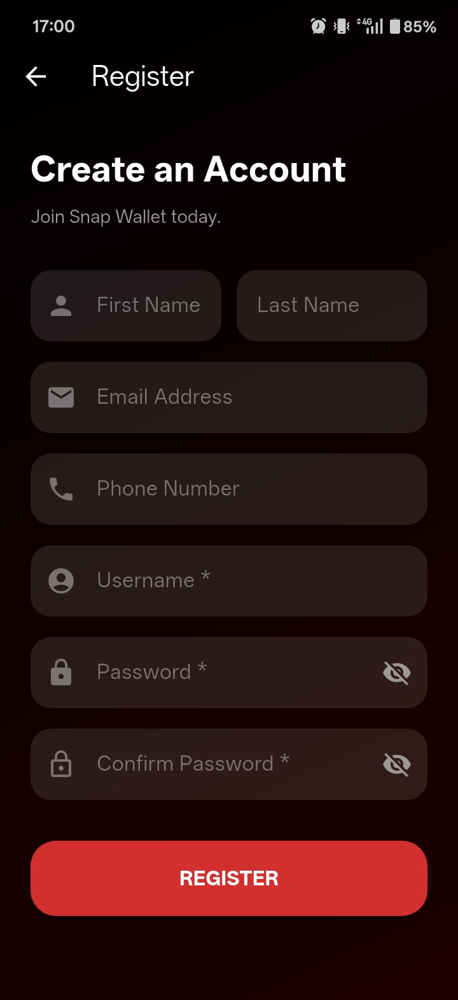

---

### 2. Forgot Password Screen
When a user forgets their password, this screen lets them enter their registered email address to receive a password-reset link via Firebase Authentication's built-in email service.

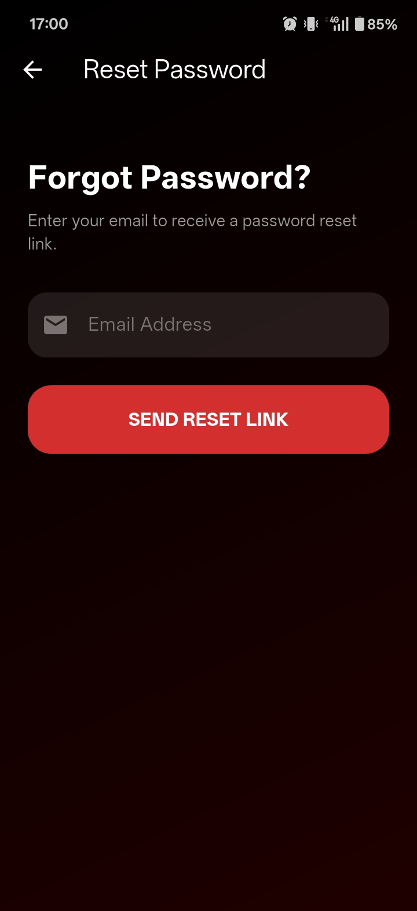

---

### 3. Enter PIN Screen
After a successful login or session restore, the app prompts the user to enter their security PIN. This adds an extra layer of protection before granting access to the wallet, simulating the PIN-gate pattern used by real banking apps.

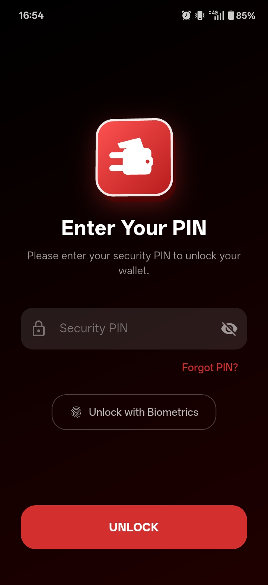

---

### 4. Dashboard Screen
The main home screen gives users a quick overview of their financial status. It shows checking and savings account balances, a list of recent transactions, quick-action buttons for cash-in and transfers, and navigation shortcuts to all major features.

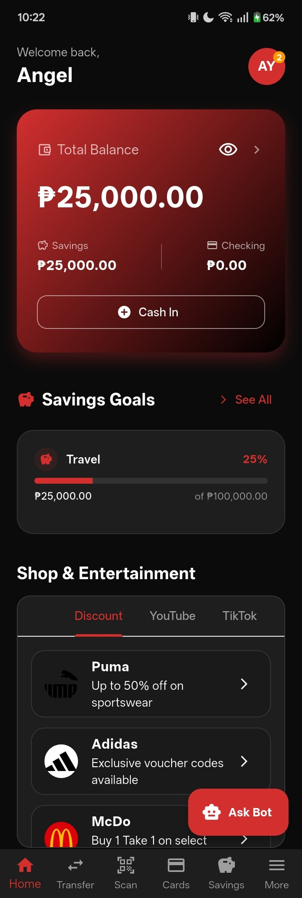

---

### 5. Accounts Screen
The accounts screen presents a detailed view of the user's checking and savings accounts. Users can see current balances, account numbers, and perform a simulated cash-in/deposit to either account. It also shows account ownership details fetched from Firestore.

---

### 6. Transfer Screen
This screen handles money transfers between accounts. Users enter a recipient's account number (or scan a QR code), specify an amount and optional note, and confirm the transaction. Completed transfers are logged in Firestore and appear in the transaction history. Beneficiaries can be saved for future use.

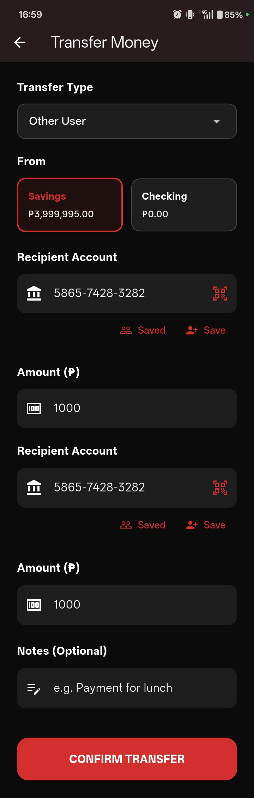

---

### 7. QR Code Screen
Each user has a personal QR code generated from their account number. Other users can scan this code on the QR scanner screen to automatically populate the recipient field on the transfer screen, making payments faster and error-free.

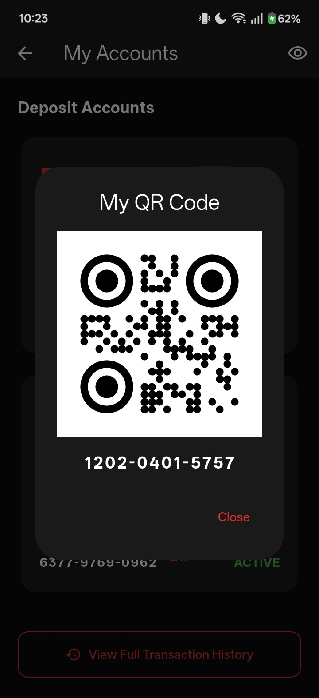

---

### 8. QR Scanner Screen
The scanner uses the device camera to read another user's QR code. Once a valid code is detected, the app decodes the account number and navigates directly to the transfer screen with the recipient field pre-filled.

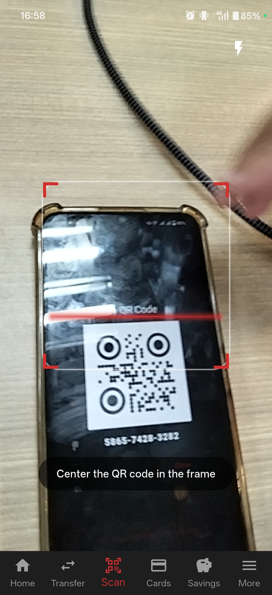

---

### 9. Bills Screen
The bills screen lists available demo billers such as utilities, subscriptions, and services. Users select a biller, enter an amount, and confirm payment. A payment reminder can also be created so the app notifies the user before a bill's due date.

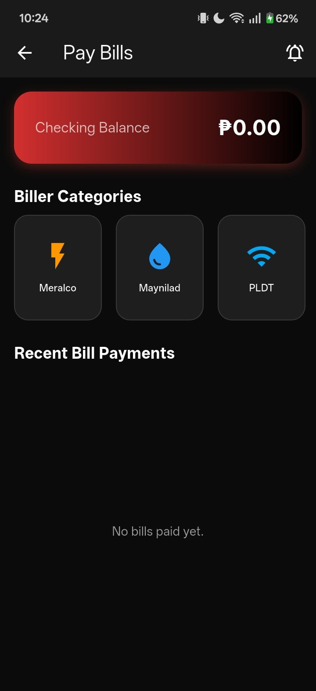

---

### 10. Brand Detail Screen
When a user taps on a biller or partner brand from the bills list, this detail screen shows brand information, available services or promos, and a button to proceed with a payment. It pulls brand metadata stored in the app's assets and Firestore.

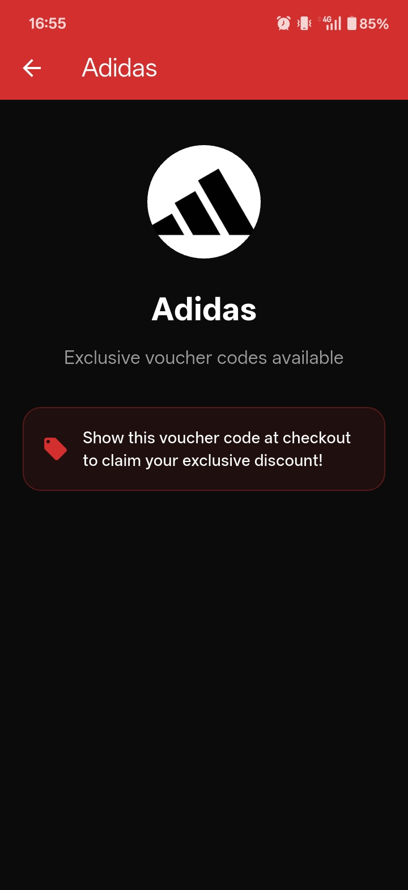

---

### 11. Cards Screen
The cards screen displays the user's virtual bank cards, including card number (masked), expiry date, and card type. Users can apply for a new card, set or update a monthly spending limit, and view card status. Card data is stored in Firestore.

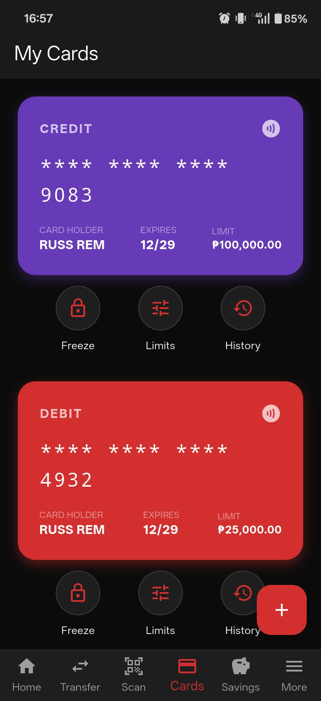

---

### 12. Savings Goals Screen
Users can create named savings goals with a target amount and optional deadline. Each goal shows a progress bar based on the amount deposited. Users can tap a goal to deposit funds, and the app supports configuring automatic savings contributions.

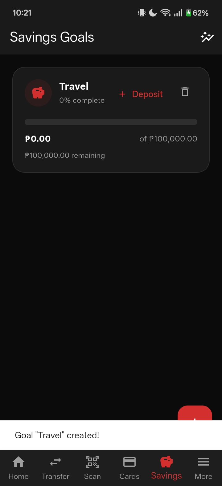

---

### 13. Scheduled Transfers Screen
This screen lists all one-time and recurring monthly transfers the user has set up. Each entry shows the recipient, amount, frequency, and next scheduled date. Users can add new scheduled transfers or cancel existing ones.

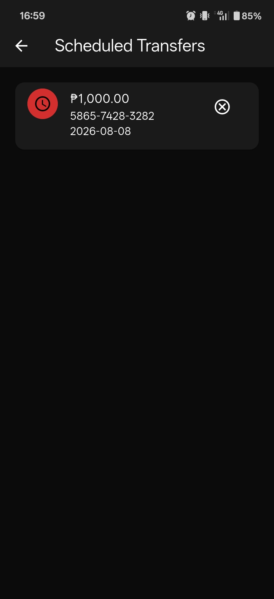

---

### 14. Transaction History Screen
A full chronological list of all transactions tied to the user's account. The screen supports filtering by type (debit, credit, transfer) and date range. Tapping a transaction opens its detail view, where the user can generate and print a PDF receipt.

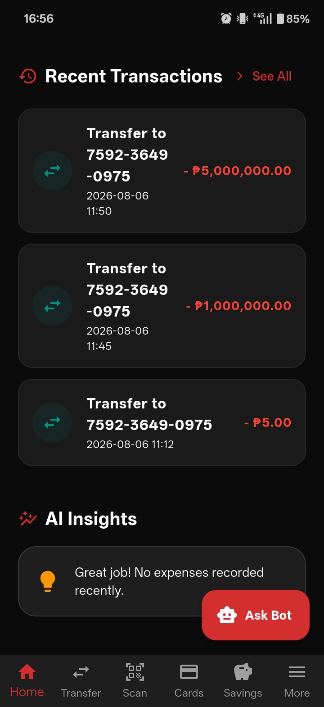

---

### 15. Analytics Screen
The analytics screen visualizes the user's spending habits using bar charts and category breakdowns powered by `fl_chart`. Users can set a monthly budget, see how much they have spent versus their limit, and identify top spending categories at a glance.

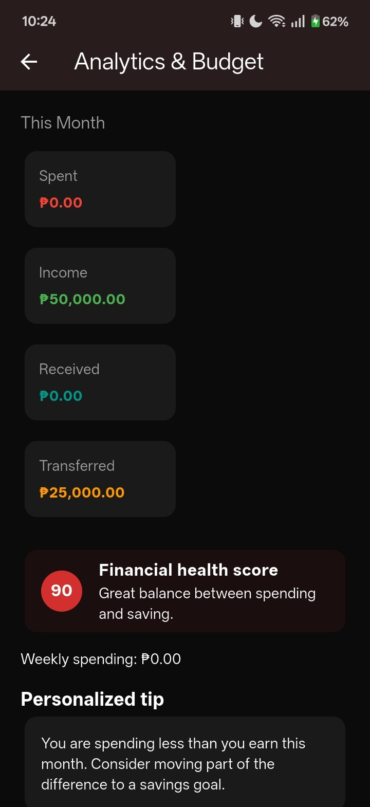

---

### 16. Notifications Screen
All in-app notifications generated by transactions, payment reminders, and system events are listed here. Unread notifications are highlighted. Users can mark individual notifications as read or clear all at once.

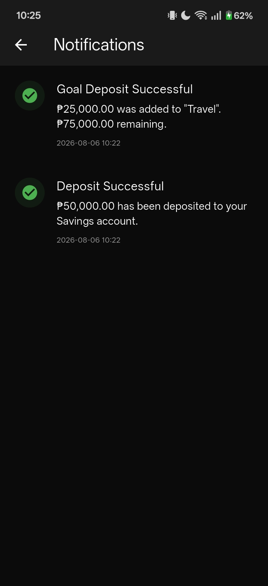

---

### 17. Profile Screen
The profile screen lets users view and edit their personal information such as display name, email, and profile photo. Changes are synced back to Firestore so they are reflected across the app immediately.

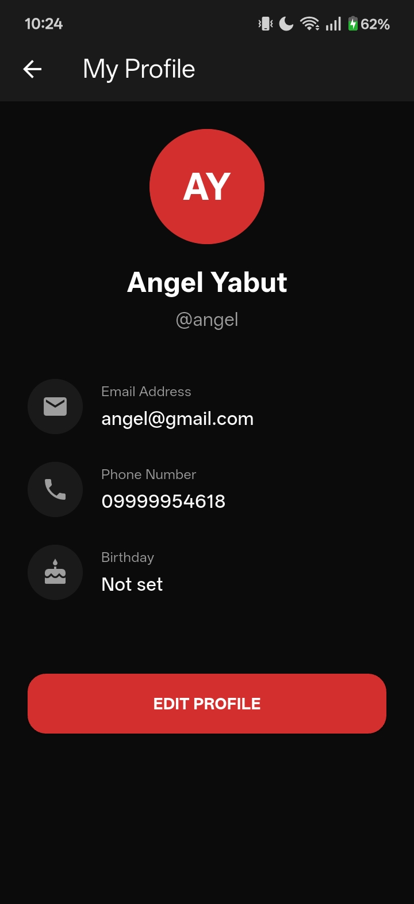

---

### 18. Settings Screen
The settings screen groups all app-level preferences in one place. Users can toggle dark mode, show or hide sensitive balance figures, manage their security PIN, enable biometric authentication, and sign out of their account.

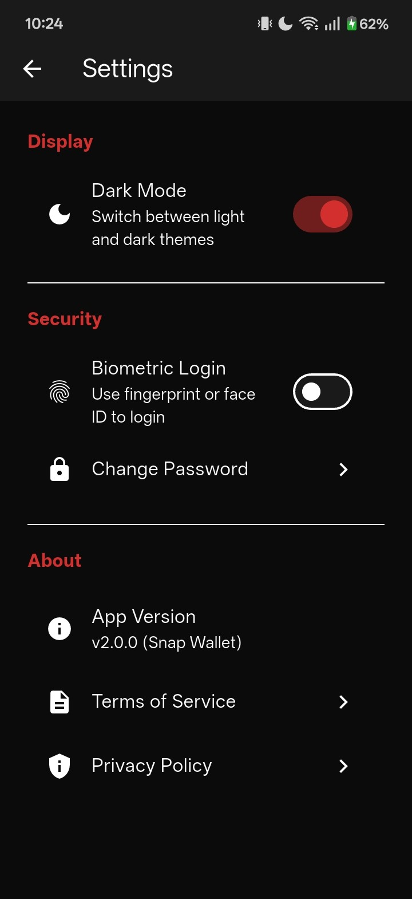

---

### 19. Chat Bot Screen
An integrated chat assistant helps users navigate the app, answer common questions about their account, and guide them through features like transfers, bill payments, and savings goals using a conversational interface.

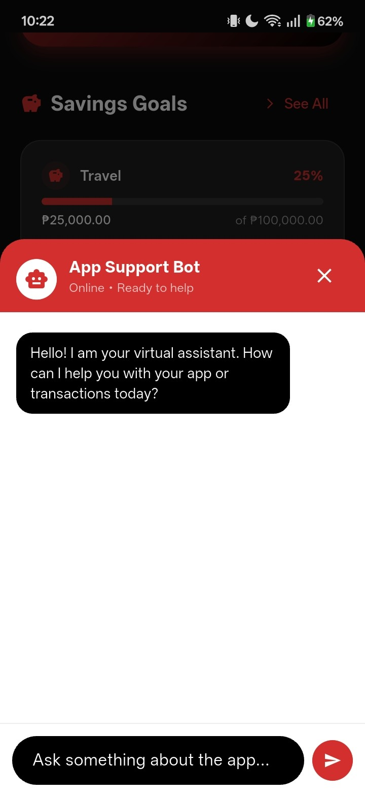

---
