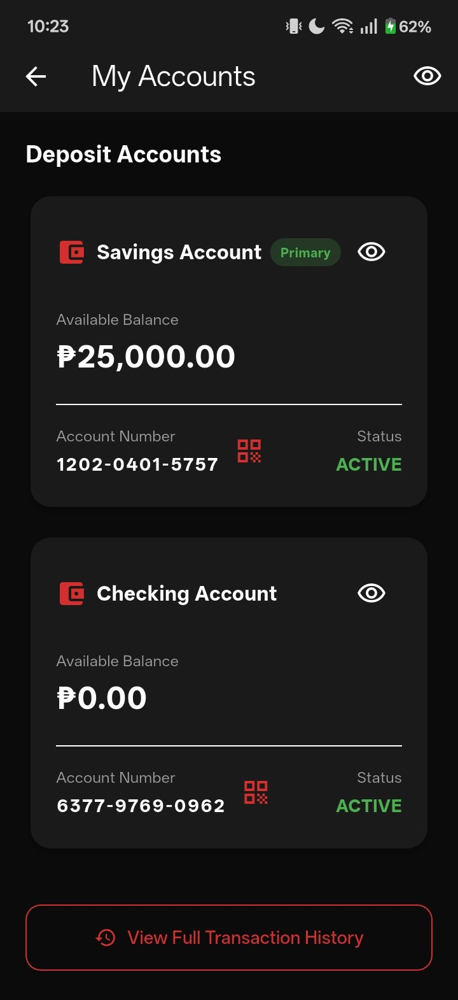

# Snap Wallet
# Group 3 TEAM BA
#GROUP MEMBERS:
Coo, Hans Dean Timothy B.
Delmendo, Angelica C. 
Godoy, Edlen Dominic L.
Remonte, Sean Russel E.
Yabut, Angel Lou F.

## About the App

**Snap Wallet** is a Flutter-based mobile banking demonstration app developed by Group 3 Team BA. It provides a single place where users can manage their accounts, monitor transactions, transfer money, pay bills, save for goals, and review their spending habits.

The app is designed to simulate a modern digital-wallet and banking experience. It uses Firebase Authentication for account sign-in and registration, Cloud Firestore for banking data such as profiles, transactions, cards, goals, and notifications, and local device storage for preferences and selected app settings.

> This project is a demo banking application. It does not connect to a real bank or process real money.

## How It Works

1. On first launch, the user sees onboarding screens introducing the app's security, transfer, and analytics features.
2. The user registers an account or signs in with an existing account. The app can restore a saved session and request a security PIN before opening the wallet.
3. After login, the dashboard displays account balances, recent transactions, quick cash-in actions, and shortcuts to the main services.
4. Banking actions such as transfers, bill payments, savings deposits, and card updates create or update the user's stored records. Users can then view those changes in their transaction history, analytics, and notifications.
5. Preferences such as dark mode, sensitive-data visibility, onboarding status, and savings automation are saved locally for the next app session.

## Main Features

- **Account access and security** — registration, login, password reset, security PIN, optional biometric authentication, session restore, and app locking.
- **Account dashboard** — checking and savings balances, cash-in/deposit simulation, recent activity, account details, and a personal QR code.
- **Money transfers** — send money to another account, scan a QR code to fill in recipient details, save beneficiaries, and schedule one-time or monthly transfers.
- **Bills and cards** — pay demo bills, create payment reminders, view bank cards, apply for a card, and set card spending limits.
- **Savings and budgeting** — create savings goals, deposit into goals, configure automatic savings, set monthly budgets, and review category-based spending analytics.
- **Transaction records** — browse and filter transactions, receive in-app notifications, and generate printable PDF receipts and monthly statements.
- **Personalization** — edit profile details, switch between light and dark themes, and hide or show sensitive balance information.

## Project Structure

- `lib/main.dart` initializes Firebase, restores saved preferences and sessions, then selects the appropriate onboarding, login, PIN, or main-app screen.
- `lib/screen/` contains the user interface for each feature, including the dashboard, transfers, QR scanner, savings goals, bills, cards, analytics, and settings.
- `lib/services/data_service.dart` contains the app's data operations for authentication, Firestore records, local preferences, transfers, scheduled transfers, and notifications.
- `lib/services/document_service.dart` generates printable PDF transaction receipts and monthly account statements.
- `lib/models/` defines the data used by the app, including users, transactions, cards, beneficiaries, notifications, savings goals, and scheduled transfers.

## Technologies Used

- Flutter and Dart for the cross-platform mobile interface
- Firebase Authentication and Cloud Firestore for user accounts and cloud data
- Shared Preferences and SQLite packages for local app data and preferences
- `mobile_scanner` and `qr_flutter` for QR code scanning and generation
- `fl_chart` for spending charts and analytics
- `local_auth` for biometric authentication
- `pdf` and `printing` for transaction receipts and statements

